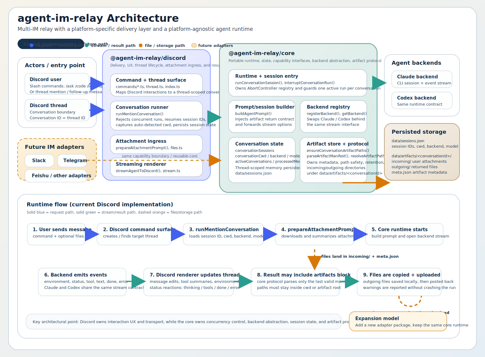

# Agent Inbox

> Run local AI agents from Discord or Feishu. Agent Inbox connects IM conversations to Claude Code or OpenAI Codex on your own machine, with no server deployment required.

[](https://www.npmjs.com/package/@doctorwu/agent-inbox)
[](https://github.com/Doctor-wu/agent-im-relay/releases)


[](https://discord.com)
[](https://open.feishu.cn)



## Why Agent Inbox

- Inbox-first workflow: start and continue agent work directly from IM messages, threads, and attachments
- Local-first runtime: configuration, session state, logs, and exchanged files stay under `~/.agent-inbox/`
- Multi-platform: currently supports Discord and Feishu with a shared relay architecture
- Multi-backend: choose Claude Code or OpenAI Codex per conversation
- Persistent sessions: keep thread context across follow-up messages, interruptions, and resumptions

## Quick Start

### 1. Install

```bash
npm install -g @doctorwu/agent-inbox

# Or run without a global install
npx @doctorwu/agent-inbox
```

### 2. Configure

Run `agent-inbox` once and follow the interactive setup wizard.

- Discord users: follow [docs/discord-setup.md](docs/discord-setup.md) to create the bot, invite it to a server, and collect `token`, `clientId`, and optional `guildIds`
- Feishu users: enter your app credentials in the same setup flow

### 3. Run

```bash
agent-inbox
```

After the relay starts, message your configured bot to begin:

- Discord: use `/code`, `/ask`, or mention the bot in a guild channel to open a thread-backed session
- Feishu: message the app and continue the session in the created chat flow

## Supported Platforms

| Platform | Status | What you get |
| --- | --- | --- |
| Discord | Supported | Slash commands, mention-to-thread sessions, streamed output, attachments, per-thread backend controls |
| Feishu | Supported | Long-connection runtime, session chat flow, streamed output, attachments, backend controls |

## Supported Backends

| Backend | Status | Notes |
| --- | --- | --- |
| Claude Code | Supported | Full code-task workflow with streaming output and tool usage |
| OpenAI Codex | Supported | Code-task workflow with streaming output through the same relay model |

## Configuration Details

Agent Inbox stores its runtime configuration in `~/.agent-inbox/config.jsonl`.

Example:

```jsonc
{"type":"meta","version":1}
{"type":"im","id":"discord","enabled":true,"config":{"token":"your-bot-token","clientId":"your-client-id","guildIds":["your-guild-id"]}}
{"type":"im","id":"feishu","enabled":false,"config":{"appId":"","appSecret":""}}
{"type":"runtime","config":{"agentTimeoutMs":600000}}
```

Notes:

- `guildIds` is optional for Discord. Set one or more guild IDs for server-scoped command registration during testing, or leave it empty for global command registration.
- The first run creates this file automatically if it does not exist yet.

## Runtime Layout

```text
~/.agent-inbox/
  config.jsonl        # Main configuration
  state/              # Session persistence
  artifacts/          # Incoming and outgoing file exchange
  logs/               # Runtime logs
```

## Repository Layout

```text
apps/
  agent-inbox/        @doctorwu/agent-inbox   - user-facing CLI entrypoint and setup flow

packages/
  core/               @agent-im-relay/core    - shared runtime, session management, backend abstraction
  discord/            @agent-im-relay/discord - Discord adapter
  feishu/             @agent-im-relay/feishu  - Feishu adapter
```

Architecture notes: [docs/agent-inbox-architecture.md](docs/agent-inbox-architecture.md)

## Development

```bash
pnpm install
pnpm test
pnpm build
pnpm start

# Platform-specific dev loops
pnpm dev:discord
pnpm dev:feishu
```

Use the repository root `.env` file for local development. See `.env.example` for the expected variables.

Build outputs:

- `apps/agent-inbox/dist/index.mjs`: npm package entrypoint
- `apps/agent-inbox/dist/agent-inbox`: optional standalone executable built separately

## License

MIT
