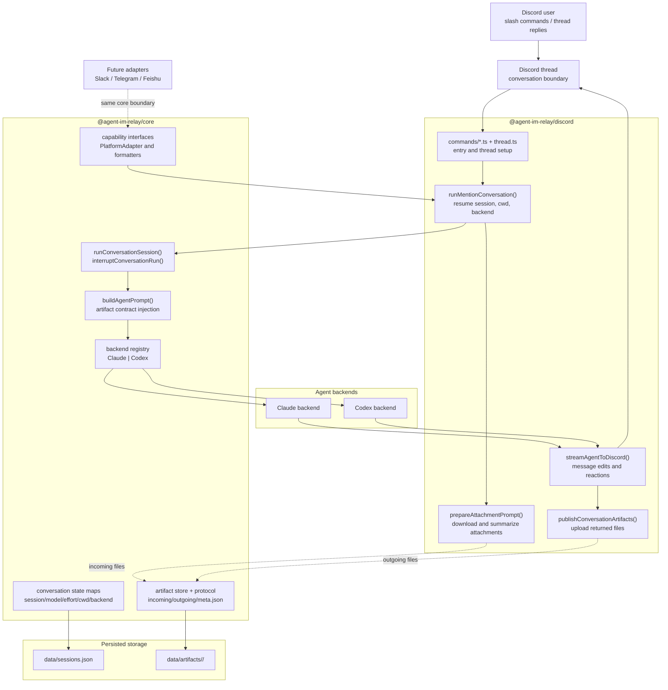

# agent-im-relay Architecture

`agent-im-relay` is organized as a pnpm monorepo with a platform-specific delivery layer and a platform-agnostic core runtime.

## Architecture Summary

- `@agent-im-relay/discord` owns Discord UX: slash commands, thread lifecycle, live streaming edits, reaction status, attachment ingress, and returned file upload.
- `@agent-im-relay/core` owns the reusable runtime: session startup, interruption, backend abstraction, state maps, artifact protocol, and persistence.
- Claude and Codex plug into the same backend stream contract, so the Discord package does not care which backend is active once the run starts.
- Future IM platforms can add new adapter packages while reusing the same core runtime and artifact/state protocol.

## Mermaid Diagram

## Runtime Flow

1. A Discord command or thread reply enters the Discord package and is mapped to a thread-scoped conversation.
2. `runMentionConversation()` restores session context and prepares the run configuration.
3. `prepareAttachmentPrompt()` downloads incoming files into `data/artifacts/<conversationId>/incoming/` and prepends local-path context to the prompt.
4. `runConversationSession()` in core builds the final prompt, selects the backend, and opens the event stream.
5. The active backend emits environment, status, tool, text, done, and error events through a shared stream contract.
6. `streamAgentToDiscord()` converts the stream into Discord message edits, environment summaries, and reaction status updates.
7. If the final answer includes an `artifacts` fenced block, the protocol validates file paths, copies approved files to `outgoing/`, and the Discord package uploads them back into the thread.

## Why This Layout Works

- The Discord package stays thin on agent logic and heavy on transport concerns.
- The core package centralizes concurrency, session continuity, backend switching, and artifact safety.
- Adding another IM platform mostly means implementing a new adapter package rather than rewriting session orchestration.
